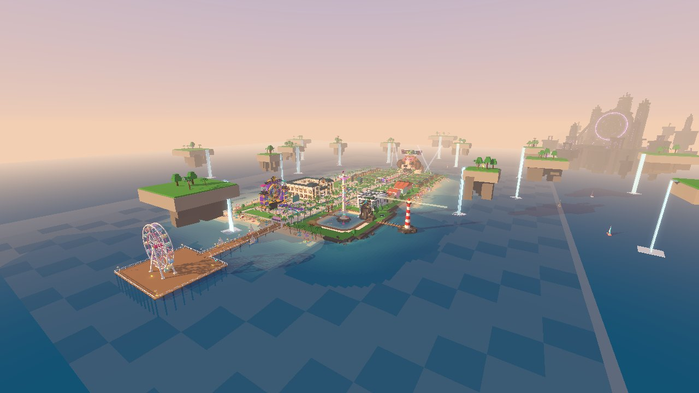
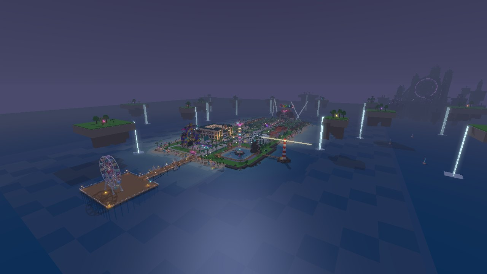
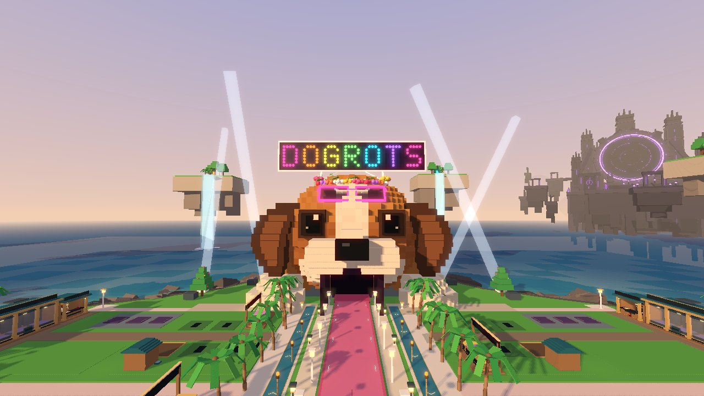
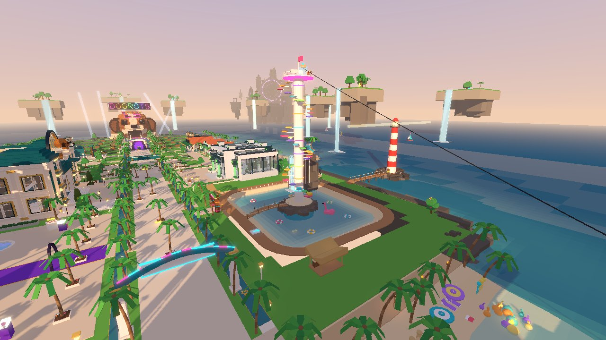
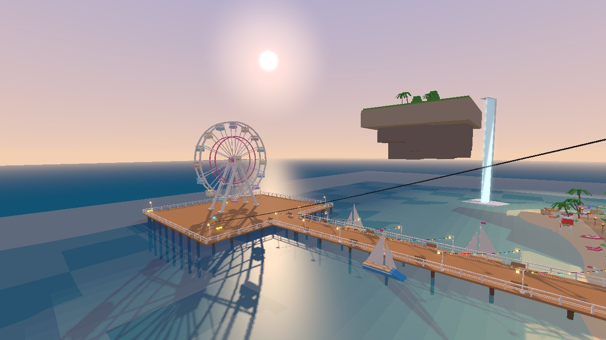
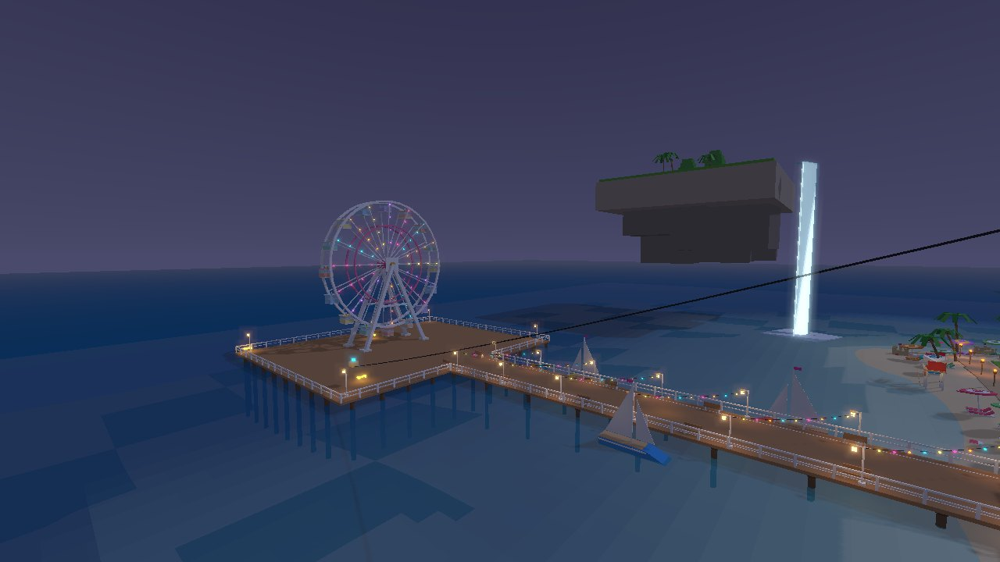
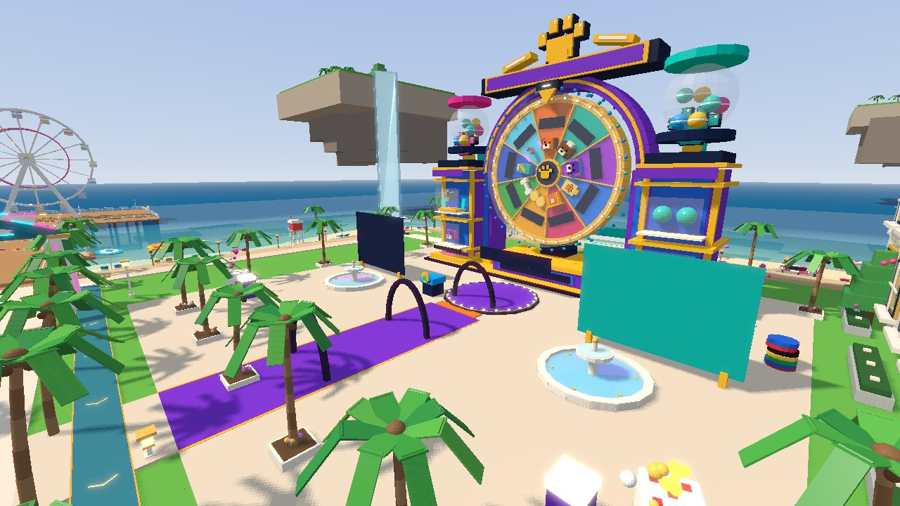
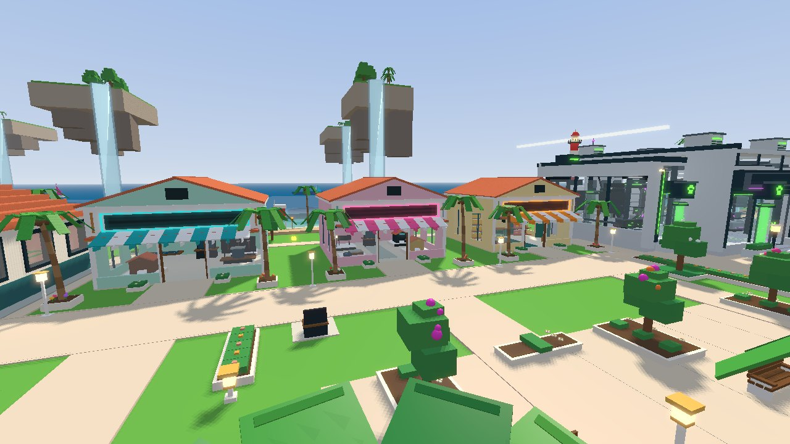
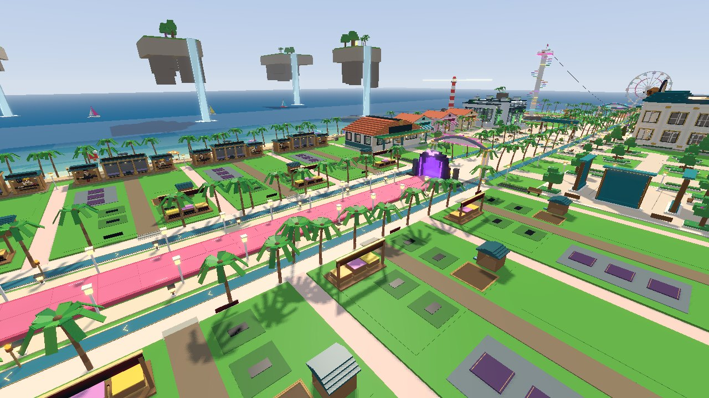
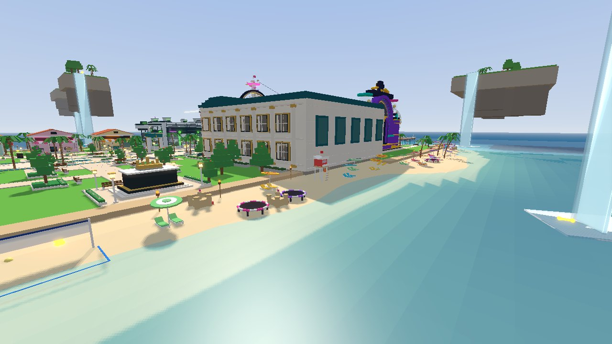

# DOGROTS: PARADISE ISLAND (V34)

Плейс DOGROTS V33, пересобранный в тропический курортный остров. Новая карта и стиль,
заремастеренные здания (их основа и вся игровая логика на месте), новые места и фишки:
океан и пляжи, лагуна с башней-обби, зиплайн и водяная горка, пирс с колесом обозрения,
маяк, летающие острова с водопадами, охота за золотыми костями, смена дня и ночи с закатами
и фейерверками.

- **`build/DOGROTS_V34.rbxl`** — готовый плейс, открывать в Roblox Studio.
- `place/DOGROTS_V33.rbxl` — исходный плейс (база, из которой собирается V34).
- `remaster/` — генератор карты (Python): всё, что построено и перекрашено на карте.
- `src/` — все скрипты плейса, один файл на инстанс (`*.server.luau` = Script,
  `*.client.luau` = LocalScript, `*.luau` = ModuleScript); `src/MANIFEST.tsv` — скрипты V33.
- `tools/` — сборка, проверки и превью-рендер.

| | |
|---|---|
|  |  |
|  |  |
|  |  |
|  |  |
|  |  |

Картинки — приблизительный программный рендер файла плейса (`tools/render/preview.py`), не скриншоты
из Roblox: в игре будут настоящие вода, свет, тени, текстуры материалов и надписи на вывесках.

## Что нового

### Карта: остров в океане
- Остров стоит в настоящем океане (Terrain): бирюзовая вода, песчаные пляжи и отмели вокруг всего
  острова, скалы на севере и востоке, песчаное дно, океан до горизонта.
- Новая палитра всего района: пастельные фасады, терракотовые крыши, белые карнизы, светлый песчаник,
  дерево и плитка вместо серого камня (перекрашено ~4 000 деталей; Void и навигация не тронуты).
- Пальмовая аллея по бульвару (42 пальмы), арки **WELCOME TO PARADISE** и **DOGROTS ISLAND**,
  цветущие деревья (392 цветка), скалы у пляжей стали песчаником.
- Пляжи: пальмы, зонтики с шезлонгами и полотенцами, тики-факелы, валуны, доски для сёрфинга,
  замки из песка, морские звёзды; 2 волейбольные площадки, 4 вышки спасателей, коралловый риф
  и скала в море.
- 14 летающих островов подняты над морем: с каждого падает водопад, по лугу течёт ручей,
  растут пальмы и парит светящийся кристалл.

### Здания: ремастер с сохранением основы
- **Голова-фабрика в отпуске**: розовые неоновые очки на лбу, венок из тропических цветов,
  вывеска **DOGROTS** из 111 разноцветных неоновых лампочек, 4 прожектора (ночью лучи в небо),
  пальмы и факелы у входа. Сама голова (глаза, анимации секреток) не изменена.
- **Магазины**: пастельные витрины UPGRADES (мятная), COSMETICS (розовая), SUPPLIES (лимонная),
  полосатые маркизы, неоновые рамки вывесок, клумбы.
- **Площадь автомата наград** стала казино-набережной: 2 фонтана, арки с лампочками,
  гигантские кости и стопки фишек, пальмы в кадках.
- Музей, лаборатория, хаб и парк — в новой палитре, у музея пальмы в кадках.
- **Дворы игроков**: скин Classic стал **PARADISE VILLA** — у каждого двора свой пастельный цвет
  (8 вариантов), терракотовая крыша, белые наличники, деревянные дорожки (с 6-го уровня — светлая
  плитка), сочный газон, с 3-го уровня в саду растёт пальма. Остальные скины работают как раньше.
  За каждой виллой — свой пляжный сад: гамак, костёр с брёвнами, шезлонги, пальмы и факелы.

### Новые места
- **Paradise Lagoon** — на месте чёрного куба COMING SOON: лагуна с дощатой набережной,
  надувной фламинго и круги, бар **COCO DOG BAR**, гора с водопадом и площадкой для прыжка в воду,
  **водяная горка** в лагуну, мостик на островок, пусковая площадка.
- **SKY TOWER** — башня-обби: 33 разноцветные ступеньки-платформы по спирали вокруг башни
  (каждая 9-я — широкая, для передышки) до короны на высоте 118.
  Наверху **сундук** (раз в 20 минут: 900 + 350 × уровень монет и 15 костей) и старт зиплайна.
- **Зиплайн** с вершины башни над пляжем до пирса (прыжок — отпустить трос).
- **Paw Pier** — длинный пирс с фонарями, гирляндами и скамейками; **колесо обозрения**
  (16 кабинок, крутится), лодки у причала и 5 парусников, которые ходят по заливу.
- **Маяк** на скалистом островке с мостиком и вращающимся лучом.
- 4 батута на пляжах.
- В карте района (навигация) новые пункты: **Paradise Lagoon** и **Paw Pier**.

### Фишки
- **Охота за золотыми костями**: 25 светящихся вращающихся костей спрятаны по всему острову —
  на башне, на вершине горы, за водопадом, на дне лагуны, под пирсом, у маяка, на вышке спасателей,
  на рифе, у водопада летающего острова... За каждую 120 + 60 × уровень монет и 3 кости, за все 25 —
  бонус 5 000 + 1 500 × уровень монет и 50 костей. Прогресс сохраняется в профиле, счётчик
  `GOLDEN BONES n / 25` справа на экране, найденная кость исчезает только у нашедшего.
- **Смена дня и ночи**: сутки ≈ 25 минут, золотой час и закат идут почти вдвое медленнее, своё настроение
  неба для рассвета, дня, золотого часа, заката и ночи (атмосфера, облака, цветокоррекция,
  солнечные лучи, звёзды). Сервер стартует в 16:24 — вскоре после входа закат.
- **Ночь**: плавно загораются фонари, факелы и костры, подсветка фонтанов, включаются лучи
  прожекторов и маяка, по колесу обозрения бегут разноцветные огни; неоновая вывеска DOGROTS,
  гирлянды пирса и кольца башни светятся в темноте.
- **Фейерверк** над заливом и лагуной каждые ~55 секунд ночью, одинаковый у всех игроков.
- Чайки над пляжами днём.
- Колесо, кабинки, лодки, маяк и кости двигаются по серверному времени — у всех одинаково.

### Техника
- Награды (кости, сундук) идут через транзакции экономики игры, сервер проверяет расстояние
  до кости/сундука и кулдаун; данные в профиле: `p.Paradise`.
- Анимации — только на клиенте (`BulkMoveTo`), дальние объекты обновляются реже или стоят;
  колесо, маяк и парусники `Persistent`, чтобы их было видно издалека при стриминге.
- `WorldDetailQuality` доработан: погашенные лампы (ночные днём) не занимают слоты света,
  бюджет частиц достаётся ближайшим эффектам.
- Конвейер, экономика, мировые события, секретные собаки, Void и т. д. не изменены. Изменённые
  существующие скрипты: `LightingConfig`, `LightingController`, `PlotCatalog`, `PlotAppearance`,
  `PlotGeometry`, `MapRouting`, `WorldDetailQuality`.
- Новые скрипты: `ServerScriptService/ParadiseServer` (вода, кости, сундук),
  `ServerStorage/ParadiseTerrain` (океан), `StarterPlayerScripts/ParadiseWorld` (+ модули
  `Motion`, `Rides`, `Pads`, `Night`, `Fireworks`, `Birds`, `Hud`).

## Как посмотреть в Studio
1. Открыть `build/DOGROTS_V34.rbxl`.
2. Океан и пляжи (Terrain) сервер строит сам при запуске — несколько секунд после старта.
   Чтобы вода была видна и в редакторе (и не строилась каждый раз), один раз выполнить в Command Bar
   `require(game.ServerStorage.ParadiseTerrain).Build()` и сохранить плейс.
3. **Play** (F5). В Output должны быть `DOGROTS_PARADISE_SERVER_READY 25 golden bones`
   и `DOGROTS_PARADISE_CLIENT_READY`.
4. Сразу посмотреть ночь: во время теста переключить Command Bar на сервер (вкладка Test →
   Client/Server) и выполнить `game.Lighting.ClockTime = 20` — цикл продолжится с этого времени.

Что проверить в первую очередь (здесь не было возможности запустить Roblox, см. «Проверки» ниже):
ощущение зиплайна и горки, сила батутов и пусковой площадки, сундук на башне, подбор костей,
ночь и фейерверк, FPS на телефоне.

Настройки: длительность суток и настроение неба — `ReplicatedStorage/LightingConfig.luau`;
награды и кулдаун сундука — начало `ParadiseServer`; период фейерверка — `ParadiseWorld/Fireworks`.

## Сборка и проверки
Нужны Python 3 (`pip install lz4 zstandard numpy pillow`) и [Lune](https://github.com/lune-org/lune) 0.10+;
для проверки имён Roblox API — один раз `tools/fetch_api.sh` (нужен npm).

- `python3 tools/build.py` — собирает `build/DOGROTS_V34.rbxl` из `place/DOGROTS_V33.rbxl`:
  генератор карты `remaster/` + скрипты из `src/`. Свой кодек `.rbxl` (`tools/rbxl.py`) читает и
  пишет файл без потерь (V33 → без изменений → байт-в-байт тот же файл), поэтому всё, что не
  тронуто, остаётся как в исходнике. `--no-map` — только скрипты, `--base`/`--out` — другие файлы,
  `DOGROTS_ZSTD_LEVEL=19` — сильнее сжатие.
- `tools/check.sh` — сборка + синтаксис Luau всех изменённых скриптов + имена Roblox API
  (классы, свойства, методы, enum) + независимый разбор готового файла через rbx-dom и проверка
  проводки Paradise (`tools/validate_place.luau`).
- `python3 tools/render/preview.py build/DOGROTS_V34.rbxl out/p --views lagoon,pier_east --golden`
  — превью-рендер (`--night`, `--view имя:ex:ey:ez:tx:ty:tz` — своя камера).
- `python3 tools/topdown.py PLACE.rbxl OUT.png [x0 z0 x1 z1 px_на_стад] [--labels]` — карта сверху;
  `python3 tools/extract.py PLACE.rbxl DIR` — выгрузить скрипты из плейса.

Генератор карты (`remaster/`, порядок в `pipeline.py`): `restyle` (палитра), `landmarks` (пирс,
колесо, маяк), `lagoon` (лагуна, башня, гора, горка, зиплайн), `areas` (аллея, арки, магазины,
казино, музей, цветы, скалы), `factory_dog` (голова-фабрика), `yards` (пляжные сады вилл),
`islands` (летающие острова), `features` (кости, лодки, батуты, вышки, навигация), `beach`
(пальмы, зонтики, факелы). Береговая линия и рельеф — `remaster/coast.py`, те же формулы в
`src/ServerStorage/ParadiseTerrain.luau`. Всё детерминировано (фиксированный seed).

### Проверки
Roblox Studio здесь запустить нельзя, поэтому проверено на уровне файла и кода: готовый плейс
разбирается rbx-dom без ошибок; синтаксис и имена Roblox API во всех 17 новых/изменённых скриптах;
генератор океана прогнан на макете Terrain (139 WriteVoxels, 202 FillBlock, рельеф совпадает с
генератором карты); транзакции наград сверены с кодом экономики; размещение всех объектов проверено
по геометрии карты (ничего не стоит в зданиях, дорожках и дворах) и превью-рендерами днём, на закате
и ночью.
